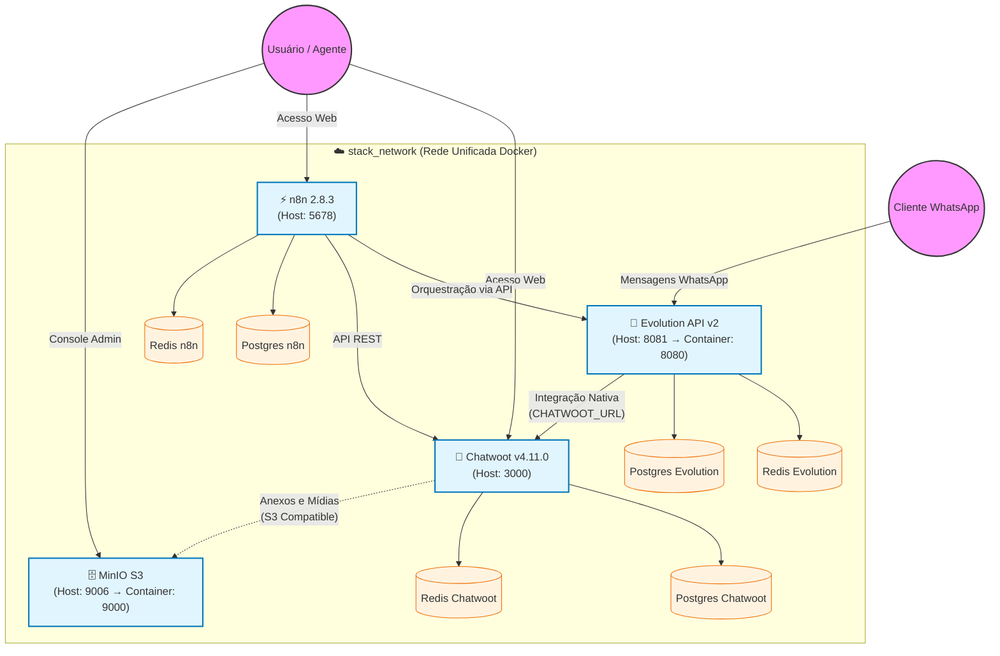

# 🚀 Automacao-BackBone

> 🚨 **DOCUMENTAÇÃO OFICIAL DO AMBIENTE (projetoravenna.cloud)** 🚨
>
> Para detalhes específicos desta implantação (domínios, credenciais, scripts de validação), consulte o:
>
> 👉 **[MANUAL DE IMPLANTAÇÃO E OPERAÇÃO](./MANUAL_DE_IMPLANTACAO.md)** 👈
>
> *Use o manual acima como referência primária para manutenção.*

Stack de **Atendimento Omnichannel + Automação de Processos**, orquestrada via Docker Compose. Composta por **Chatwoot**, **Evolution API**, **MinIO** e **n8n**, com bancos de dados e caches completamente isolados por serviço.

O projeto é modular, seguro e pronto para produção: limites de recursos, healthchecks, rotação de logs e armazenamento persistente configurados em todos os serviços.

---

## 📋 Índice

1. [Arquitetura da Solução](#-arquitetura-da-solução)
2. [Fluxograma de Dados](#-fluxograma-de-dados)
3. [Componentes da Stack](#-componentes-da-stack)
4. [Mapa de Portas](#-mapa-de-portas)
5. [Pré-requisitos](#-pré-requisitos)
6. [Instalação e Deploy](#-instalação-e-deploy)
7. [Pós-Instalação (Setup Inicial)](#-pós-instalação-setup-inicial)
8. [Estrutura de Diretórios](#-estrutura-de-diretórios)
9. [Segurança e Firewall](#-segurança-e-firewall)
10. [Troubleshooting](#-troubleshooting)
11. [Guias de Integração](#-guias-de-integração)

---

## 🏛 Arquitetura da Solução

Todos os serviços compartilham uma **rede Docker externa** (`stack_network`), o que permite comunicação direta via DNS interno (nome do serviço) e facilita a integração com outras stacks do mesmo servidor.

Cada serviço principal possui **seu próprio Postgres e Redis dedicados**, evitando qualquer acoplamento de dados entre componentes.

O **MinIO** desta stack usa as portas `9006` (API S3) e `9007` (Console) no host, pois o servidor já possui outro MinIO (app backbone) em uso. Internamente, o MinIO continua ouvindo nas portas padrão `9000`/`9001`.

---

## 🔄 Fluxograma de Dados



---

## 🧩 Componentes da Stack

### 1. Chatwoot `v4.11.0`
- **Função:** Plataforma de atendimento ao cliente (WhatsApp, Live Chat, Email).
- **Imagem:** `chatwoot/chatwoot:v4.11.0`
- **Dependências:** Postgres (`pgvector/pgvector:pg15`) + Redis 7 dedicados.
- **Storage:** Arquivos salvos no MinIO via protocolo S3.

### 2. Evolution API `v2.3.7`
- **Função:** Gateway WhatsApp baseado na biblioteca Baileys. Conecta aparelhos celulares e converte mensagens em Webhooks.
- **Imagem:** `evoapicloud/evolution-api:v2.3.7`
- **Dependências:** Postgres 16 + Redis 7 dedicados.
- **Integração:** Conectado nativamente ao Chatwoot via `CHATWOOT_URL=http://chatwoot_web:3000`.

### 3. n8n `2.8.3`
- **Função:** Hub de automação Low-Code. Orquestra fluxos entre Evolution API, Chatwoot e sistemas externos.
- **Imagem:** `n8nio/n8n:2.8.3`
- **Dependências:** Postgres 16 + Redis 7 dedicados.
- **Webhooks:** Expostos via `https://n8n.projetoravenna.cloud/`.

### 4. MinIO `RELEASE.2024-11-07`
- **Função:** Object Storage compatível com S3. Armazena todos os anexos e mídias do Chatwoot.
- **Imagem:** `minio/minio:RELEASE.2024-11-07T00-52-20Z`
- **Bucket auto-criado:** `chatwoot` (com subpasta `public` pública).
- **Portas no host:** `9006` (API S3) e `9007` (Console).

---

## 🗺 Mapa de Portas

| Serviço | Porta Host | Porta Container | Exposição |
|---|---|---|---|
| Chatwoot Web | `3000` | `3000` | Via proxy reverso (aaPanel) |
| Evolution API | `8081` | `8080` | Via proxy reverso (aaPanel) |
| n8n | `5678` | `5678` | Via proxy reverso (aaPanel) |
| MinIO API S3 | `9006` | `9000` | Via proxy reverso (`minio.projetoravenna.cloud`) |
| MinIO Console | `9007` | `9001` | Via proxy reverso (acesso admin) |
| Redis (Chatwoot) | ❌ não exposta | `6379` | Apenas interno |
| Redis (Evolution) | ❌ não exposta | `6379` | Apenas interno |
| Redis (n8n) | ❌ não exposta | `6379` | Apenas interno |
| Postgres (Chatwoot) | ❌ não exposta | `5432` | Apenas interno |
| Postgres (Evolution) | ❌ não exposta | `5432` | Apenas interno |
| Postgres (n8n) | ❌ não exposta | `5432` | Apenas interno |

> ⚠️ Os Redis e Postgres **não têm portas expostas no host** por segurança. O acesso é exclusivamente via rede interna Docker (`stack_network`).

---

## ⚙️ Pré-requisitos

- **Sistema Operacional:** Linux Ubuntu 22.04+ (recomendado) ou servidor com aaPanel
- **Docker:** v24.0+
- **Docker Compose:** v2.20+ (plugin, não standalone)
- **Hardware Mínimo:**
  - CPU: 4 vCPUs
  - RAM: 8 GB (para rodar todos os serviços com folga)
  - Disco: 50 GB SSD livre
- **Domínios configurados** no aaPanel com SSL (Let's Encrypt) e Proxy Reverso:
  - `atendimento.projetoravenna.cloud` → `http://127.0.0.1:3000`
  - `evolution.projetoravenna.cloud` → `http://127.0.0.1:8081`
  - `n8n.projetoravenna.cloud` → `http://127.0.0.1:5678`
  - `minio.projetoravenna.cloud` → `http://127.0.0.1:9006`

---

## 🚀 Instalação e Deploy

### 1. Clonar o repositório

```bash
git clone https://github.com/yurythx/Automacao-BackBone.git
cd Automacao-BackBone
```

### 2. Configurar variáveis de ambiente

> ⚠️ O repositório **não inclui** os arquivos `.env` por segurança. Crie-os a partir dos exemplos:

```bash
# Copiar os exemplos:
cp .env.example .env
cp Chatwoot/.env.example Chatwoot/.env

# Gerar o SECRET_KEY_BASE para o Chatwoot:
openssl rand -hex 64

# Editar com os valores do seu ambiente:
nano .env          # ajuste todos os CHANGE_ME_*, SERVER_URL e domínios
nano Chatwoot/.env # ajuste todos os CHANGE_ME_*, FRONTEND_URL, S3_ENDPOINT e domínios
```

Consulte o **[MANUAL_DE_IMPLANTACAO.md](./MANUAL_DE_IMPLANTACAO.md)** (seção 3.1) para a lista completa de campos obrigatórios.

### 3. Criar a rede Docker (apenas na primeira vez)

```bash
docker network create stack_network
```

### 4. Verificar disponibilidade das portas

```bash
# Garantir que as portas 9006 e 9007 do MinIO estão livres:
ss -tlnp | grep -E '9006|9007'
```

### 5. Subir a stack

```bash
docker compose up -d
```

### 6. Acompanhar a inicialização

Os serviços `chatwoot_web` e `evolution_api` executam migrações de banco na primeira inicialização. Aguarde de 1 a 2 minutos:

```bash
docker compose logs -f chatwoot_web
```

---

## 🏁 Pós-Instalação (Setup Inicial)

Após os containers estarem saudáveis:

1. **Chatwoot:** Acesse `https://atendimento.projetoravenna.cloud` → Crie sua conta administrador e a empresa.
2. **n8n:** Acesse `https://n8n.projetoravenna.cloud` → Configure usuário e senha no primeiro acesso.
3. **MinIO Console:** Acesse `http://IP:9007` → Login com as credenciais do `.env`.
4. **Evolution API:** Acesse `https://evolution.projetoravenna.cloud/manager` → Crie a primeira instância WhatsApp.

Para as integrações entre os serviços, consulte os [Guias de Integração](#-guias-de-integração).

---

## 📂 Estrutura de Diretórios

```plaintext
Automacao-BackBone/
├── compose.yaml                    # Orquestrador raiz (inclui todos os sub-stacks)
├── .env                            # Variáveis globais (Evolution, n8n, MinIO, senhas)
├── .gitignore
│
├── Chatwoot/
│   ├── compose.yaml                # Chatwoot Web + Worker + Postgres + Redis
│   └── .env                        # Variáveis específicas do Chatwoot (Rails, S3)
│
├── evolution/
│   └── compose.yaml                # Evolution API + Postgres + Redis
│
├── n8n/
│   ├── compose.yaml                # n8n + Postgres + Redis
│   └── workflow.json               # Workflow base importável
│
├── minio/
│   └── compose.yaml                # MinIO + createbuckets (setup automático)
│
├── scripts/
│   ├── README.md
│   ├── test_services.ps1           # Diagnóstico geral dos serviços
│   ├── test_minio_connection.ps1   # Teste de conexão com o MinIO
│   ├── test_storage_integration.ps1# Teste end-to-end de upload de arquivos
│   ├── test_n8n_webhook.ps1        # Teste de disparo de webhook n8n
│   └── setup_n8n_webhook.ps1       # Criação de webhook Chatwoot → n8n via API
│
├── MANUAL_DE_IMPLANTACAO.md        # ⭐ Referência primária de operação
├── INTEGRACAO_CHATWOOT_MINIO.md    # Guia detalhado do storage S3
├── INTEGRACAO_CHATWOOT_N8N.md      # Guia detalhado de webhooks
└── INTEGRACAO_WHATSAPP.md          # Guia de conexão WhatsApp ↔ Chatwoot ↔ n8n
```

---

## 🛡️ Segurança e Firewall

### Portas que devem ser liberadas no firewall do servidor

```bash
sudo ufw allow 22/tcp    comment 'SSH'
sudo ufw allow 80/tcp    comment 'HTTP'
sudo ufw allow 443/tcp   comment 'HTTPS'
sudo ufw allow 3000/tcp  comment 'Chatwoot'
sudo ufw allow 5678/tcp  comment 'n8n'
sudo ufw allow 8081/tcp  comment 'Evolution API'
sudo ufw allow 9006/tcp  comment 'MinIO API S3'
sudo ufw allow 9007/tcp  comment 'MinIO Console'
sudo ufw reload
```

> **Nota para aaPanel:** Adicione estas mesmas portas em **Security → Firewall** no painel visual.

### Boas práticas aplicadas nesta stack

- ✅ Redis e Postgres **sem exposição de porta** no host
- ✅ Todos os serviços com **`restart: always`** (ou `unless-stopped`)
- ✅ Limites de CPU e memória (`deploy.resources`) em todos os containers
- ✅ Logs com **rotação automática** (`max-size: 10m`, `max-file: 3`)
- ✅ **Healthchecks** em todos os serviços críticos (Evolution, Postgres, Redis, MinIO)
- ✅ Comunicação interna via **nome de serviço Docker** (sem IPs estáticos)
- ✅ MinIO com `FORCE_SSL=true` e `FORCE_PATH_STYLE=true`

---

## 🔧 Troubleshooting

### Chatwoot não exibe tela de cadastro

Execute o reset do banco (⚠️ apaga dados):

```bash
docker compose -f Chatwoot/compose.yaml down -v
docker compose up -d
docker exec chatwoot_web bundle exec rails db:prepare
```

### Erro de conexão no banco de dados

```bash
# Verificar status dos containers
docker compose ps

# Ver logs do banco do Chatwoot
docker logs chatwoot_db

# Ver logs da Evolution
docker logs postgres_evolution
```

### Portas ocupadas no MinIO

As portas `9006` e `9007` são específicas desta stack. Se outra aplicação estiver nelas:

```bash
# Identificar o processo
ss -tlnp | grep -E '9006|9007'

# Ou altere S3_PORT e S3_CONSOLE_PORT no .env raiz
```

### Evolution API não conecta ao Chatwoot

Verifique se a variável `CHATWOOT_URL=http://chatwoot_web:3000` está correta e se os dois containers estão na mesma rede:

```bash
docker exec evolution_api wget --spider -q http://chatwoot_web:3000
```

---

## 📲 Guias de Integração

1. **Integração WhatsApp completa (fluxo principal):**
   - Conexão do número, QR Code, Webhooks Evolution → Chatwoot → n8n
   - 👉 **[INTEGRACAO_WHATSAPP.md](./INTEGRACAO_WHATSAPP.md)**

2. **Integração de armazenamento (MinIO/S3):**
   - Configuração do S3, variáveis de ambiente, troubleshooting de uploads
   - 👉 **[INTEGRACAO_CHATWOOT_MINIO.md](./INTEGRACAO_CHATWOOT_MINIO.md)**

3. **Integração Chatwoot → n8n (Webhooks internos):**
   - Solução para validação de URL e criação via API
   - 👉 **[INTEGRACAO_CHATWOOT_N8N.md](./INTEGRACAO_CHATWOOT_N8N.md)**
