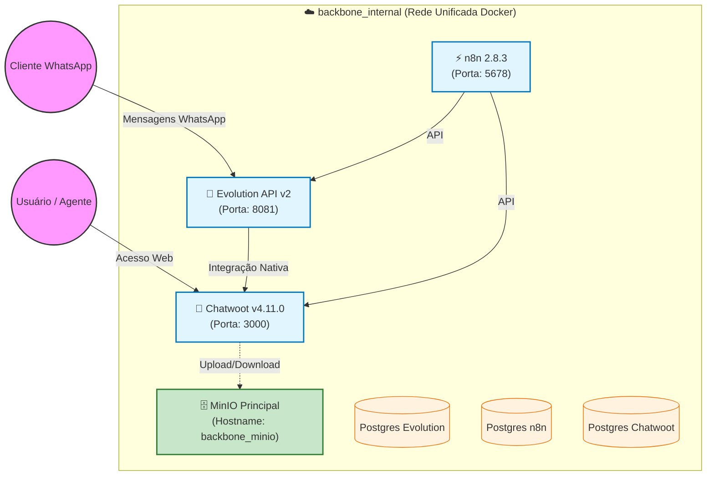

# 🚀 Automacao-BackBone

> 🚨 **DOCUMENTAÇÃO OFICIAL DO AMBIENTE (projetoravenna.cloud)** 🚨
> Para detalhes específicos desta implantação (domínios, credenciais, scripts de validação), consulte o:
> 👉 **[MANUAL DE IMPLANTAÇÃO E OPERAÇÃO](./MANUAL_DE_IMPLANTACAO.md)** 👈

Stack de **Atendimento Omnichannel + Automação de Processos**, orquestrada via Docker Compose. Composta por **Chatwoot**, **Evolution API** e **n8n**, integrada à rede principal do projeto Backbone (**`backbone_internal`**).

O projeto é modular, seguro e utiliza o **MinIO principal** do servidor para armazenamento persistente de mídias, garantindo consistência de dados e economia de recursos.

---

## 🏛 Arquitetura da Solução

Todos os serviços compartilham a **rede Docker do Backbone** (`backbone_internal`), o que permite comunicação direta via DNS interno (nome do serviço) sem a necessidade de proxies manuais ou conectores bridge.

- ✅ **Isolamento de Dados:** Cada serviço possui seu próprio Postgres e Redis dedicados.
- ✅ **Storage Centralizado:** Utiliza o container `backbone_minio` pré-existente no servidor.
- ✅ **Comunicação Nativa:** Integração direta entre Chatwoot (via API) e Evolution API.

---

## 🔄 Fluxograma de Dados



---

## 🧩 Componentes da Stack

### 1. Chatwoot `v4.11.0`
- **Função:** Plataforma de atendimento (WhatsApp, Live Chat, Email).
- **Storage:** Persistência no MinIO principal (`chatwoot` bucket).

### 2. Evolution API `v2.3.7`
- **Função:** Gateway WhatsApp baseado na biblioteca Baileys. Conecta aparelhos celulares.

### 3. n8n `2.8.3`
- **Função:** Hub de automação Low-Code. Orquestra fluxos entre sistemas.

---

## 📂 Estrutura de Diretórios (Atualizada)

```plaintext
Automacao-BackBone/
├── compose.yaml                    # Orquestrador raiz unificado
├── .env                            # Variáveis globais (DNS, passwords)
├── Chatwoot/
│   ├── compose.yaml                # Chatwoot Web + Worker + DBs
│   └── .env                        # Variáveis Chatwoot (Rails, S3)
├── evolution/
│   └── compose.yaml                # Evolution API + DBs
├── n8n/
│   └── compose.yaml                # n8n + DBs
├── scripts/                        # Scripts de diagnóstico e validação
├── MANUAL_DE_IMPLANTACAO.md        # ⭐ Referência primária
└── INTEGRACAO_CHATWOOT_MINIO.md    # Guia detalhado S3 (Externo)
```

---

*Repositório mantido para a solução Automacao-BackBone — 2026.*
